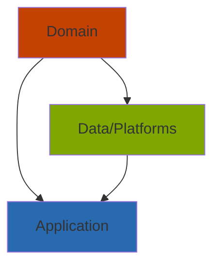

# Clean-архитектура
Про сам подход можно почитать [тут](https://github.com/sergdort/CleanArchitectureRxSwift).

Вкратце

- Слой Domain содержит описание протоколов сервисов, юзкейсов, модели данных
- Слой Data или несколько Platform содержат реализацию сервисов.
- Слой Application отвечал за работу с пользователем использую безнесс-логику из Domain, применяя реализацию сервисов из Data.
## Как это выглядит в проекте
Да, никак.
Есть разделение на интерфейсную часть и реализацию. Но выносить интерфейсы в один pod-модуль, а реализацию в другой – это значит усложнять граф-зависимостей.

**Может, в следующих итерациях сможем улучшить этот момент.**
<!--stackedit_data:
eyJoaXN0b3J5IjpbMTg1MjQ1MjQ5NywxMjAxOTIxNzkxLDI3NT
I2NDEyLDIyODAwNzgyNiwtMTQ4NTA5Mzg2NCw4MjE4Nzc0NjYs
LTEwNzIyNzUwMTZdfQ==
-->