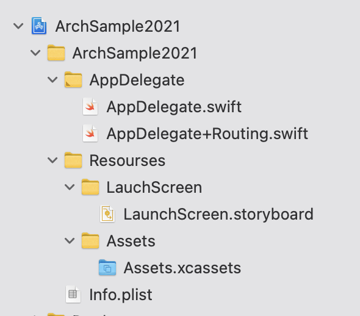
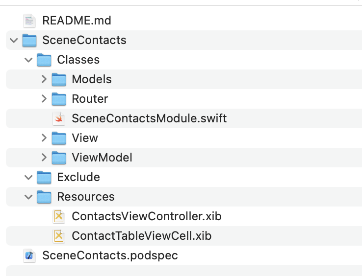

# Модульная архитектура проекта с использованием CocoaPods
Впечатлиться можно [тут](https://tech.olx.com/modular-architecture-in-ios-c1a1e3bff8e9).
## Папка `Application`
Папка `Application` содержит 
- базовые ресурсы приложения (графические ассеты, launchimage);
- AppDelegate;
- расширение для вызова самой первой сцены.


## Папка `Modules`
Папка `Modules` содержит
Папки, каждая из которых содержит `.podspec`-фаил который описывает ее как pod.
## Как заставить все это работать ?
Шаг 1. Подключить каждый ваш pod в `Podfile`.
Например так:
```
pod "RoutingCore", :path => "./Modules/RoutingCore"
```
Шаг 2. Выполнить `pod install`
# Дьявол в деталях
## А откуда берутся модули ?
Для каждого проекта лучше завести шаблоны для xCode. 
- общий шаблон для произвольного пода (pod)
>пример такого шаблона `Empty Pod.xctemplate` есть в этом репозитории.
- шаблон для пода который содержит сцену (чтобы не прописывать вьюхи, вьюмодели и ротуер руками)
> TODO: сделать такой в этом проекте
## Структура модуля


Например модуль `SceneContacts`
- `SceneContacts.podspec` – спецификация пода.
- `README.md` – описание пода. У меня содержит код для вставки в Podfile и в podspec.
- `SceneContacts` –  контент пода
  - `Classes` – классы модуля `{h,m,swift,xib}`
  - `Resources` – ресурсы модуля, которые должны быть доступны извне. `{xib, png, и т.п.}`
  - `Exclude` – внутренние ресурсы, которые не нужно экспортировать в основное приложение.

## Дьяволенок #1
Ресурсы внутри пода должны быть доступны снаружи.
Например, я использую верстку в `.xib`-файлах. 
- положил их папку в Resources
- дополнил podscec
Например модуль `SceneContacts`
```
## Добавляем ресурсы в бандл
spec.resource_bundles = {
    'SceneContactsResources' => ['SceneContacts/Resources/**/*.xib']
}
spec.exclude_files = "SceneContacts/Exclude"
```
## Дьяволенок #2
Статические(static) либы, например, Google SignIn.
Если вы добавите его как простую зависимость в нужный модуль
`spec.dependency ' GoogleSignIn'`,
 то вы получите ошибку при компиляции. 
Кажется такую:
>```
>Undefined symbols for architecture x86_64: >"_OBJC_CLASS_$_GIDSignIn", referenced from: objc-class-ref in GoogleSignInManagerImpl.o
>ld: symbol(s) not found for architecture x86_64
>```
Можно нагуглить такое решение `spec.static_framework = true`
Но это вызовет каскад ошибок при использовании модуля в нескольких местах. Потому что:
> any pod that depends upon a static_framework must also be static

**Решение** есть: включать static-либу как внутренний ресурс пода.
```
spec.vendored_frameworks = "Frameworks/GoogleSignIn.framework", "Frameworks/GoogleSignInDependencies.framework"
spec.pod_target_xcconfig = {
    "OTHER_LDFLAGS" => '$(inherited) -ObjC -framework "GoogleSignIn"',
    "CLANG_MODULES_AUTOLINK" => "YES"
}
```
**Нюанс**. Придется включить в проект 
- все явные зависимости этой либы
> ```
> spec.frameworks = "Foundation", "UIKit", "LocalAuthentication", "SafariServices", "AuthenticationServices", "SystemConfiguration"
> spec.dependency "AppAuth"
> ```
- вытащить наружу ресурсы этой либы, если они есть
 >`spec.resources = "Frameworks/GoogleSignIn.bundle"`
 - а так же ее неявные зависимости. (Самый простой способ их посмотреть  – в podspec-файле на сайте Cocoapods.org)
>```
> spec.dependency "GTMAppAuth"
> spec.dependency "GTMSessionFetcher/Core"
>```
<!--stackedit_data:
eyJoaXN0b3J5IjpbOTI4NDgxNzQyLDE0NzcyMzYxNSwtMTE4Nz
MzMDU2NSwtMjk3MTU3NjQwLC0xNzI4NTcwOTIwLC03NTUwOTA4
MTAsMjAwODEzOTc0Niw2OTAwNzE0MDgsNzMwOTk4MTE2XX0=
-->