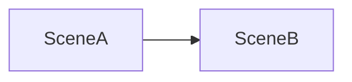
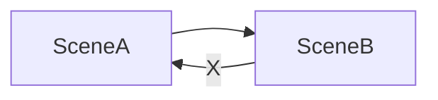
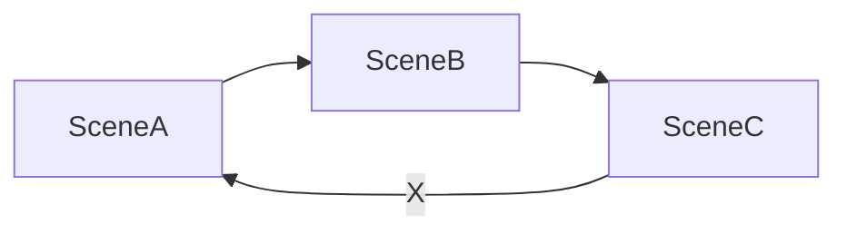
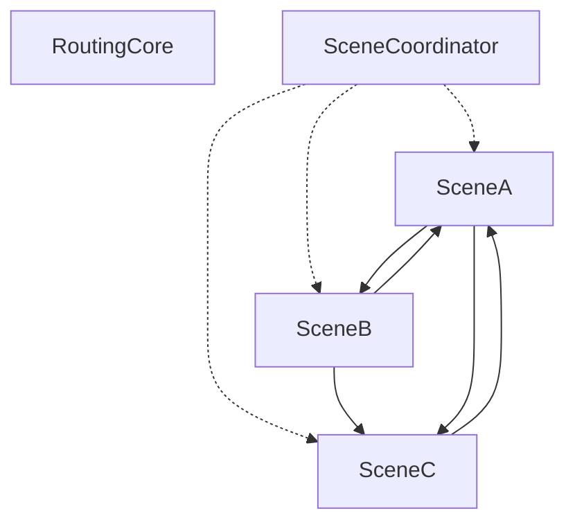
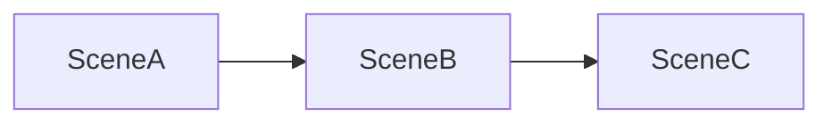

# Ω-flexible routing
Описание подхода можно прочитать [тут](https://medium.com/rosberryapps/the-flexible-routing-approach-in-an-ios-app-eb4b05aa7f52).
>Ω (Омега). Префикс добавлен чтоб как-то подчеркнуть различие в особенностях реализации.
## Дано
Сцена "А" имеет роутер, в роутере описаны маршруты в другие сцены. 
Сцена "Б" тоже имеет роутер.
Мы хотим переходить из "А" в "Б" .
Чтобы описать маршруты надо иметь в поле видимости все необходимые сцены.  Поэтому сцена "А" импортирует сцену "Б" и видит путь к нему.

## Проблема циклических ссылок
Но, если у нас возникнет необходимость перейти из сцены "Б" в сцену "А", то надо будет заимпортить в "А" в "Б".

Вот, более неочевидный вариант, когда все зависимости "последовательные"

## Как работает в проекте
Остался общий концепт, что у нас есть описание маршрутов, и есть маршрутизаторы, которые используются сценами для понимания куда идти дальше.
Реализация теперь выглядит так:

1. Модуль `RoutingCore`
- содержит все необходимые протоколы (и немного реализации) для организации Flexible Routing;
- содержит все маршруты которые возможны в приложении.
2. Любая сцена 
- импортирует `RoutingCore` и знает о всех возможных маршрутах в приложении;
- объявляет протокол `SceneRoute`, в котором перечисляет методы, сообщающие о том, как можно показать эту сцену;
- объявляет протокол `SceneRouter` в котором перечисляет те маршруты, которые считает необходимыми для себя;
- во время инициализации сцена принимает роутер, удовлетворяющий протоколу SceneRouter.
3. Модуль `SceneCoordinator `
- импортирует все сцены проекта (и `RoutingCore` по принципу транзитивности); это дает возможность видеть все `SceneRoute` – знать обо всех маршрутах в приложении.
- Расширяет протоколы `SceneRoute` реализацией перехода к сценам. Это дает возможность реализовать маршруты ко всем сценам в области видимости. 
- Создает экземпляр роутера `SceneRouterImp` который будет заинжектен в каждую сцену.

## А можно попроще?
Да, это возможно. Если между сценами нет возможности появления циклических ссылок, то можно инжектить их последовательно.

## А еще ...
Можно координаторами реализовывать комплексные процессы, например, один бы описывал маршруты при регистрации в приложении, а другой – маршруты при оформлении заказа.
<!--stackedit_data:
eyJoaXN0b3J5IjpbLTYzMDgzODU2Miw5NjI5OTY3MDAsLTg3Mj
M2MzkxOCwxMzQ5NzUzNzYwLC0zNzc1NTM4NSwtMTQwMzU2Njc5
MywtMjA4ODc0NjYxMiw3MzA5OTgxMTZdfQ==
-->